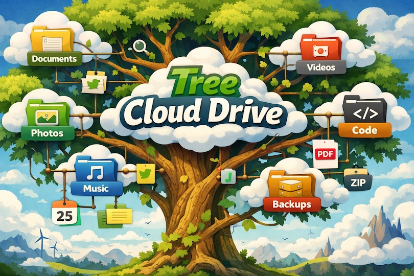

# Tree Cloud Drive

**Version:** 0.2.0
Author: Rich Lewis - GitHub: [@RichLewis007](https://github.com/RichLewis007)

Browse your cloud drives like a friendly file explorer. The classic `tree` command shows a simple textual tree of local folders. Tree Cloud Drive takes that idea and makes it interactive for any selected cloud remote: you get a clickable tree of folders, plus actions like downloading — all from a desktop app instead of a web browser. It uses your local installation of the trusted open source `rclone` tool to list and download cloud folders. This is safer than handing passwords or API keys to a new app, because authentication and access stay inside rclone’s well‑tested configuration and your existing credentials never pass through Tree Cloud Drive directly.

**What you can do**

- Pick a cloud remote from a dropdown.
- Choose a top‑level folder and browse subfolders in a tree.
- Right‑click any folder to download it locally with rclone progress.
- Switch between light and dark themes.

**Quick start**
Prerequisites:

- Install and configure `rclone` for your cloud provider.
- Python 3.13+

Launch the app:

```bash
uv run tree-cloud-drive
```

If rclone is set up correctly, this should work:

```bash
rclone listremotes
```

**How to use**

1. Choose a remote from the “Cloud remote” dropdown.
2. Pick a top‑level folder.
3. Expand the tree to browse subfolders.
4. Right‑click a folder and choose “Download folder” to save it locally.

**Need to tweak or contribute?**
Developer docs live in `Developer.md`.
